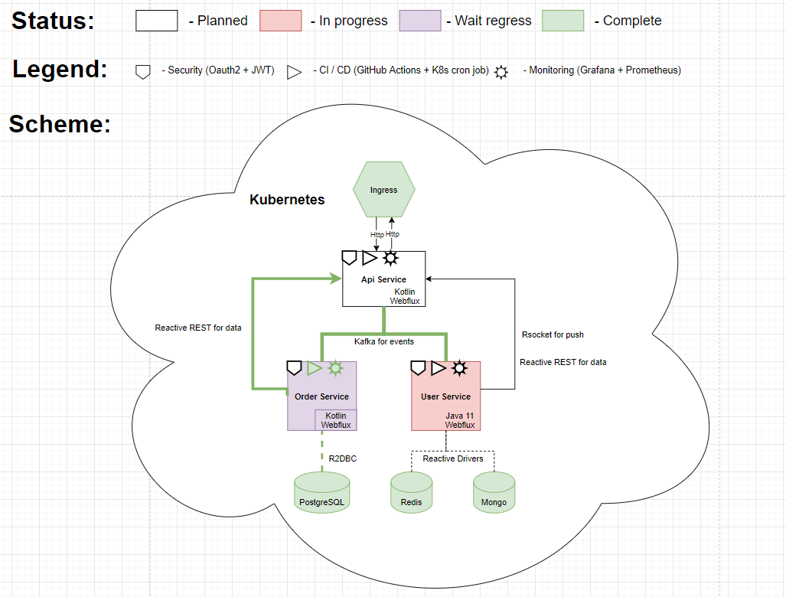

### K8s configuration for all components of Event Driven Architecture (EDA) pet project.




## Components repositories:

Order service: https://github.com/alexandr-leonov/eda-order-service

<br>
<br>

## Install infrastructure

```
# Set up 1 node k8s

> minikube start --memory=6144

# Go to environment folder

> cd dev

# install evnironment settings

> kubectl apply -f namespace.yaml
> kubectl apply -f secret.yaml

# install components

> kubectl apply -f postgres/postgres-cluster.yaml

> kubectl apply -f kafka/zookeeper-cluster.yaml
> kubectl apply -f kafka/kafka-borker.yaml

> helm repo add bitnami https://charts.bitnami.com/bitnami
> helm install mongo-cluster -f mongodb/values.yaml bitnami/mongodb --namespace eda-dev

# install services
# (each service has CI config based on GitHub actions)

> kubectl apply -f services/order-service.yaml

# Create automate CD process with 4h refresh images policy
> kubectl apply -f system/rights.yaml
> kubectl apply -f system/scheduler.yaml

```


<br/>
<br/>

## K8s management console commands:

<br>

For get info about infrastructure item: 
```
kubectl -n (namesapce) get (deployments/statefulsets/services/pods)

Example: 

> kubectl -n postgres-cluster get pods
```

For get current ip / port: 
```
kubectl -n (namespace) get svc (service)

Example: 

> kubectl -n postgres-cluster get svc postgres-service
```

For get logs: 
```
kubectl -n (namespace) logs (pod)

Example: 

> kubectl -n postgres-cluster logs postgres-deployment-67f5fc7cdb-hsc4l
```

<br/>
<br/>

# Work with Kafka
Create topics:
```
1) kubectl -n (namespace) exec -it (pod) bash
2) `script to create topic`

Example:

> kubectl -n "eda-dev" exec -it kafka-0 bash
> kafka-topics.sh --create --zookeeper zookeeper-service.eda-dev.svc.cluster.local:2181  --replication-factor 1 --partitions 1 --topic "order-topic"
```

Show topics:
```
> kubectl -n "eda-dev" exec -it kafka-0 bash
> kafka-topics.sh --list --bootstrap-server localhost:9092
```

Show all messages from topic:
```
> kubectl -n "eda-dev" exec -it kafka-0 bash
> kafka-console-consumer.sh --bootstrap-server localhost:9092 --topic "order-topic" --from-beginning
```

# Add Prometheus + Graphana
```
# Install:
> kubectl apply -f monitoring/namespace.yaml
> helm upgrade --install prometheus --set-file extraScrapeConfigs=monitoring/prometheus/values.yaml stable/prometheus --namespace monitoring
> kubectl apply -f monitoring/config.yaml
> helm install grafana stable/grafana -f monitoring/values.yaml --namespace monitoring

# View Graphana generated password
> kubectl get secret --namespace monitoring grafana -o jsonpath="{.data.admin-password}" | base64 --decode ; echo

# Open random graphana port (because need to implement ingress)
> kubectl expose pod grafana-58f6744674-sfbcz --type=NodePort

# View prometheus config
> kubectl -n monitoring exec -it prometheus-server-7bc886d65-7kvqf  -c prometheus-server cat /etc/config/prometheus.yml

```

Then create simple test dashboard for Order Service as example:


## Links to materials:
- https://github.com/d1egoaz/minikube-eda-dev
- https://github.com/scriptcamp/kubernetes-jenkins
- https://kubernetes.io/docs/concepts/services-networking/service/#environment-variables
- https://stackoverflow.com/questions/52422300/how-to-schedule-pods-restart
- https://habr.com/ru/company/southbridge/blog/526130/
- https://nirajsonawane.github.io/2020/05/17/Monitoring-Spring-Boot-Application-with-Prometheus-and-Grafana-on-Kubernetes/
- https://github.com/grafana/helm-charts/tree/main/charts/grafana
- https://habr.com/ru/company/agima/blog/524654/
- https://stackoverflow.com/questions/55360726/how-to-add-extrascrapeconfigs-to-prometheus-helm-chart-from-set-argument
- https://www.programmingwithwolfgang.com/create-grafana-dashboards-with-prometheus-metrics/
- https://github.com/bitnami/charts/tree/master/bitnami/mongodb